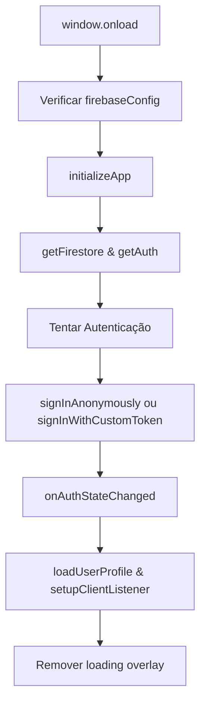

# 📋 Documentação Técnica - Sistema de Gestão de Clientes

## 🏢 **Informações do Projeto**
- **Curso**: SENAI - Bar & Restaurante
- **Sistema**: Gestão de Clientes com Firebase
- **Versão**: 1.0.0
- **Data**: Outubro 2025

---

## 🎯 **Objetivos do Sistema**

### Objetivo Principal
Desenvolver um sistema web responsivo para gestão de clientes integrado ao Firebase, permitindo autenticação, armazenamento de perfis de usuários e listagem em tempo real de clientes cadastrados.

### Objetivos Específicos
- ✅ Implementar autenticação Firebase (anônima ou token personalizado)
- ✅ Criar interface responsiva com Tailwind CSS
- ✅ Gerenciar perfis de usuários no Firestore
- ✅ Exibir lista de clientes em tempo real
- ✅ Garantir experiência otimizada em dispositivos móveis e desktop

---

## 🏗️ **Arquitetura do Sistema**

### Frontend
- **Framework CSS**: Tailwind CSS 3.x via CDN
- **JavaScript**: ES6+ Modules
- **Fonte**: Inter (Google Fonts)
- **Responsividade**: Mobile-first design

### Backend
- **Banco de Dados**: Firebase Firestore
- **Autenticação**: Firebase Authentication
- **Hosting**: Servidor HTTP local (Python/Node.js)

### Estrutura de Arquivos
```
Gestão_Clientes/
├── 📁 .vscode/               # Configurações VS Code
├── 📁 assets/                # Recursos estáticos
│   ├── 📁 css/
│   │   └── styles.css        # Estilos personalizados
│   └── 📁 js/
│       └── client-manager.js # Lógica modularizada
├── 📄 .gitignore            # Exclusões Git
├── 📄 index.html            # Página principal (original)
├── 📄 index-optimized.html  # Página principal (otimizada)
├── 📄 test.html             # Página de teste (original)
├── 📄 test-optimized.html   # Página de teste (otimizada)
├── 📄 package.json          # Configurações Node.js
├── 📄 README.md             # Documentação geral
└── 📄 OPTIMIZATION-REPORT.md # Relatório de otimizações
```

---

## 🔧 **Configuração e Dependências**

### Dependências de Desenvolvimento
```json
{
  "devDependencies": {
    "live-server": "^1.2.2"
  }
}
```

### Scripts npm
```json
{
  "start": "python -m http.server 8080",
  "dev": "live-server --port=8080 --watch=.",
  "test": "echo 'Servidor iniciado! Acesse: http://localhost:8080/test.html' && python -m http.server 8080"
}
```

### Requisitos do Sistema
- **Node.js**: v14+ (para desenvolvimento)
- **Python**: 3.7+ (para servidor HTTP)
- **Navegador**: Moderno com suporte a ES6 modules

---

## 🎨 **Design System**

### Paleta de Cores
```css
:root {
  --primary-color: #4f46e5;    /* Índigo */
  --secondary-color: #10b981;  /* Esmeralda */
  --gray-50: #f9fafb;
  --gray-600: #4b5563;
  --gray-700: #374151;
  --gray-800: #1f2937;
}
```

### Tipografia
- **Fonte Principal**: Inter (sans-serif)
- **Tamanhos**: text-sm (14px), text-xl (20px), text-3xl (30px)
- **Pesos**: font-medium (500), font-semibold (600), font-bold (700)

### Layout Responsivo
- **Mobile**: Grid de 1 coluna
- **Desktop**: Grid de 3 colunas (1:2 ratio)
- **Breakpoints**: lg (1024px+)

---

## 🔐 **Sistema de Autenticação**

### Variáveis Globais Esperadas
```javascript
const appId = typeof __app_id !== 'undefined' ? __app_id : 'default-app-id';
const firebaseConfig = typeof __firebase_config !== 'undefined' ? JSON.parse(__firebase_config) : {};
const initialAuthToken = typeof __initial_auth_token !== 'undefined' ? __initial_auth_token : null;
```

### Fluxo de Autenticação
1. **Inicialização**: `initializeApp(firebaseConfig)`
2. **Método**: Anônimo (`signInAnonymously`) ou Token (`signInWithCustomToken`)
3. **Observer**: `onAuthStateChanged` monitora estado do usuário
4. **Resultado**: Define `userId` global para operações Firestore

---

## 🗄️ **Estrutura de Dados Firestore**

### Schema do Banco
```
artifacts/
└── {appId}/
    ├── users/
    │   └── {userId}/
    │       └── profile/
    │           └── data              # Documento do perfil
    │               ├── name          # string
    │               ├── company       # string
    │               └── createdAt     # timestamp
    └── public/
        └── data/
            └── clients/              # Coleção de clientes
                └── {clientId}        # Documento do cliente
                    ├── name          # string
                    ├── email         # string
                    ├── addedBy       # string (userId)
                    └── timestamp     # timestamp
```

### Regras de Segurança Recomendadas
```javascript
// Perfil do usuário: apenas o próprio usuário pode ler/escrever
match /artifacts/{appId}/users/{userId}/profile/data {
  allow read, write: if request.auth != null && request.auth.uid == userId;
}

// Clientes públicos: usuários autenticados podem ler, apenas criador pode escrever
match /artifacts/{appId}/public/data/clients/{clientId} {
  allow read: if request.auth != null;
  allow create: if request.auth != null;
  allow update, delete: if request.auth != null && request.auth.uid == resource.data.addedBy;
}
```

---

## 🎛️ **Componentes da Interface**

### Header
- **Título**: Sistema de Gestão de Clientes
- **Status**: Informações do usuário autenticado
- **Classes**: `bg-white shadow-lg rounded-xl p-4 mb-8`

### Seção de Perfil
- **Elementos**: 
  - Status de carregamento (`profile-status`)
  - Dados do perfil (`profile-data`)
  - Botão salvar (`save-profile-btn`)
- **Estados**: hidden/visible baseado em dados disponíveis

### Lista de Clientes
- **Container**: `client-list` (ul element)
- **Itens**: Gerados dinamicamente via JavaScript
- **Layout**: Card com borda esquerda colorida
- **Estados**: Vazia, com dados, erro

### Loading Overlay
- **Comportamento**: Exibido durante inicialização
- **Componentes**: Spinner SVG + texto
- **Controle**: Removido após autenticação completa

---

## 🔄 **Fluxo de Dados**

### Inicialização da Aplicação


### Carregamento do Perfil
```mermaid
graph TD
    A[loadUserProfile] --> B[Verificar db e userId]
    B --> C[doc reference: artifacts/{appId}/users/{userId}/profile/data]
    C --> D[getDoc]
    D --> E{Documento existe?}
    E -->|Sim| F[Exibir dados do perfil]
    E -->|Não| G[Exibir botão para criar perfil]
```

### Listener de Clientes
```mermaid
graph TD
    A[setupClientListener] --> B[collection reference: artifacts/{appId}/public/data/clients]
    B --> C[onSnapshot]
    C --> D[Processar snapshot]
    D --> E{Tem clientes?}
    E -->|Sim| F[Renderizar lista]
    E -->|Não| G[Exibir mensagem vazia]
```

---

## 🧪 **Ambiente de Teste**

### Configuração de Teste (test.html)
```javascript
window.__app_id = 'test-app-id';
window.__firebase_config = JSON.stringify({
    apiKey: "test-key",
    authDomain: "test.firebaseapp.com",
    projectId: "test-project",
    storageBucket: "test-project.appspot.com",
    messagingSenderId: "123456789",
    appId: "1:123456789:web:abcdef123456"
});
```

### Dados Simulados
- **Clientes**: João Silva (test-001), Maria Santos (test-002)
- **Perfil**: Usuário Gestor (Teste), Empresa de Teste
- **Comportamento**: Fallback automático quando Firebase falha

---

## 🚀 **Deploy e Execução**

### Desenvolvimento Local
```bash
# Clonagem
git clone https://github.com/cristiano-superacao/gestao_clientes.git
cd gestao_clientes

# Instalação
npm install

# Execução
npm start        # Servidor Python na porta 8080
npm run dev     # Live-server com hot reload
npm run test    # Servidor com mensagem de teste
```

### URLs Disponíveis
- **Principal**: http://localhost:8080/index.html
- **Otimizada**: http://localhost:8080/index-optimized.html
- **Teste**: http://localhost:8080/test.html
- **Teste Otimizado**: http://localhost:8080/test-optimized.html

---

## 🔍 **Monitoramento e Debug**

### Logs do Firebase
```javascript
setLogLevel('debug'); // Ativado por padrão
```

### Console Messages
- Inicialização do Firebase
- Estados de autenticação
- Operações do Firestore
- Erros de carregamento

### Elementos de Status
- `user-info`: Status da autenticação
- `profile-status`: Status do carregamento do perfil
- `client-error`: Erros na listagem de clientes

---

## 📱 **Compatibilidade**

### Navegadores Suportados
- **Chrome**: 88+
- **Firefox**: 85+
- **Safari**: 14+
- **Edge**: 88+

### Recursos Utilizados
- ES6 Modules (import/export)
- CSS Grid e Flexbox
- Fetch API
- Promises/Async-Await
- Local Storage (potencial futuro)

---

## 🔧 **Manutenção e Evolução**

### Pontos de Extensão
1. **Adicionar CRUD completo de clientes**
2. **Implementar busca e filtros**
3. **Adicionar upload de imagens**
4. **Criar relatórios e dashboards**
5. **Implementar notificações push**

### Melhorias Técnicas Sugeridas
1. **Service Workers** para funcionamento offline
2. **Bundle tools** (Webpack/Vite) para otimização
3. **Testes automatizados** (Jest/Cypress)
4. **CI/CD pipeline** com GitHub Actions
5. **Monitoramento** com Firebase Analytics

---

## 📞 **Suporte e Contato**

- **Repositório**: https://github.com/cristiano-superacao/gestao_clientes
- **Documentação**: README.md no repositório
- **Issues**: GitHub Issues para bugs e sugestões
- **Curso**: SENAI - Bar & Restaurante

---

*Documentação gerada em: 27 de outubro de 2025*